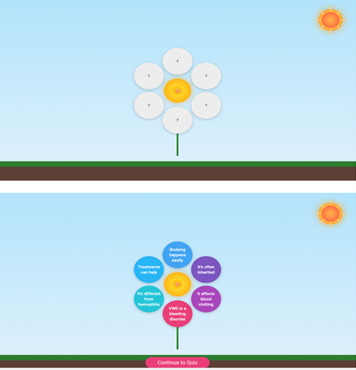
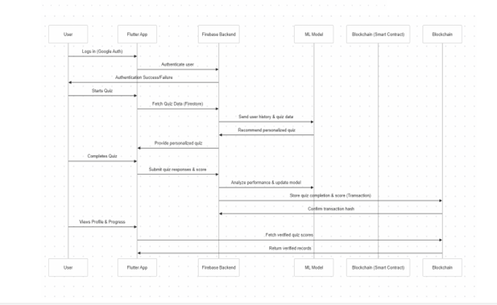
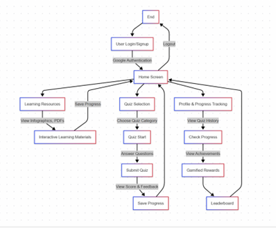

# 🩸 VWD Education App for Kids (WIP)

An educational mobile app for children with Von Willebrand Disease (VWD), designed to teach key medical facts, safety behaviors, and emergency responses through interactive mini-games. Built with Flutter and Firebase, and focused on gamified health education.

> 🚧 This project is currently in progress. Game mechanics, visuals, and logic are actively being refined.

---

## 🎯 Problem & Motivation

Children with VWD often struggle to understand why bruising, bleeding, and lifelong medication compliance matter. Traditional handouts are text-heavy and ineffective for pediatric learning. This app turns essential VWD knowledge into a game-like experience that’s easy to understand and fun to use.

---

## 🛠️ Solution Overview

### 🧩 Petal Reveal Engine
- Six animated petals hide core facts.
- Tap-to-reveal behavior rewards exploration with colors and animations.

### 🧠 Drag-and-Drop Quiz
- Interactive quiz to classify facts as true/false.
- Built-in feedback through animations.

### 🚨 Emergency Scenario Mini-Game
- Reinforces correct actions during common emergencies (e.g. nosebleeds).
- Progress tracked with visual indicators and feedback colors.

### 🤖 Clotty – The AI Chatbot
- Uses GPT-4 to answer kids’ health questions in age-appropriate language.
- Fallback logic allows offline responses.

---

## ⚙️ Tech Stack

- **Frontend:** Flutter 3.19 (Material 3)
- **Backend:** Firebase (Firestore, Auth) – optional but planned
- **AI Integration:** OpenAI GPT-4 (via REST API)
- **CI/CD:** GitHub Actions with automated builds & tests

---

## 📐 Diagrams & Screenshots

📸 **Diagrams and Screenshots**    

  
  
  

---

## 📊 Evaluation & Impact

Tested with five pediatric users (ages 9–12):
- **Pre-test average:** 3.4 / 10
- **Post-test average:** 8.2 / 10  
→ **+141% knowledge gain**

---

## 🚀 Project Status

- ✅ Game modules functional
- ✅ AI chatbot connected
- ⏳ Firebase sync & analytics in progress
- 🧪 Adding more testing + feedback handling
- 🖼️ Screenshots and public demo coming soon

---

## ✍️ Author

**Imaad Fahimuddin**  
Flutter Developer | CS Graduate | Advocate for gamified health education

---

## 📜 License

This project is for educational, academic, and demo use only.  
Please consult healthcare professionals for official medical advice.
